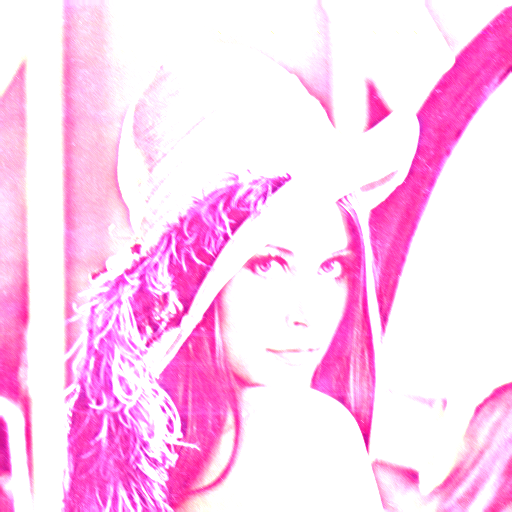

# IP-Wrapper

Implementation for Image Processing Filters using OpenCV in C++.

For the partial fulfillment of the course **CS F301 Principles of Programming Language**.

## Installation Guide

### Installing OpenCV on Ubuntu

1. Install the dependencies

```bash
sudo apt-get install -y build-essential cmake git pkg-config libgtk2.0-dev
```

2.1 Download the source


2.2. On the GitHub page, copy the HTTPS link from the code button.


3. Open terminal and type the following

```bash
# Clone the repository
git clone url

# Build the source.
mkdir -p build && cd build

# Generate the Build Script.
cmake ../opencv

# Build the Source
make -j4

# Install the OpenCV package
sudo make install
```

That’s it. If you did not encounter any error then OpenCV is installed successfully on your Linux system. The header files are at the appropriate location.

### Downloading the code repository -

1. Create a folder and then change the current working directory.
```bash
mkdir check && cd check
```

2. Clone the repository from Github.
```bash
git clone https://github.com/Neo-PL/IP-Wrapper.git
```

3. Make sure you have cmake & make installed, To install run,
```bash
sudo apt-get install cmake make
```

and then run the following set of commands.
```bash
cmake . && make
```

Once you have successfully executed all the steps, now you can run the application using the pdi executable file.

## Usage - Test Cases

For testing the functionality of the filters we will be using the popular Image of Lenna, widely used in Image Processing.

The image is already present in the repository.

To run the program.
```bash
./[this tool] [input file name] [mono | color] [filter number] [filter options]
```

### Example -

1. Salt and Pepper filter
```bash
./pdi lenna.png color 7
```
The above commands generate salt and pepper noise in the image provided and generates a new image with the following noise.


2. Custom Mask Filter (E.g. Gaussian Mask - Smoothens Images)
```bash
./pdi lenn.png color 30 ./kernels/gaussian.txt
```
The above command creates a custom Mask based on the matrix value provided in the gaussian.txt file. Extensive Documentation can be found on GitHub.




3. Splitting Images
```bash
./pdi lenna.png color 5
```
The following line of code Splits the image into the 3 color channels and based on the Number Entered [4,5,6] : [R,G,B], we get the output.


## Wish to Contribute?

Fork the repository and make a pull request. We will review the changes and merge them if they are valid :)

## Contributors:
- [Yash Khanna](https://github.com/YKhanna2003)
- [Piyush Mohite](https://github.com/git-pi-e)
- [Harsh Gujarathi](https://github.com/Newrex)
- [Dhruv Rohira](https://github.com/rohira-dhruv)
- [Manank Patel](https://github.com/manank20)
- [Manav Tanna]()
